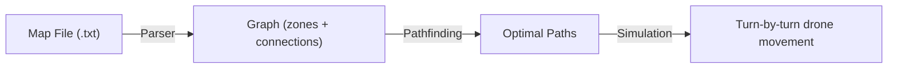
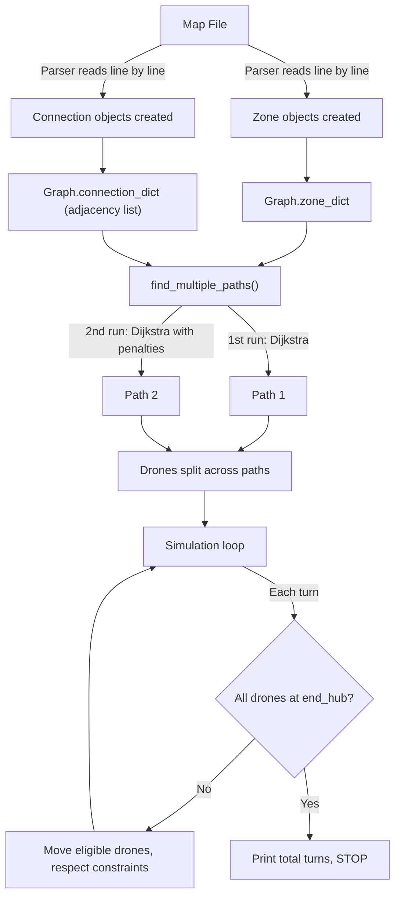

# Fly-in Project — Evaluation Guide

> How to explain the **Graph**, **Algorithms**, and **Simulation** when asked.

---

## 1. The Big Picture — What Does the Project Do?

The project simulates **drones flying from a start hub to an end hub** across a map of zones. It:

1. **Parses** a map file → builds a graph
2. **Finds optimal paths** through the graph using pathfinding algorithms
3. **Simulates** drone movement turn by turn, respecting capacity constraints



---

## 2. The Graph — Data Structure

### What is it?

The graph is an **undirected, weighted, cyclic graph** stored as an **adjacency list**.

### Components

| Concept | Class | Role |
|---------|-------|------|
| **Node** | `Zone` | A location on the map (has name, x/y position, type, color, max_drones) |
| **Edge** | `Connection` | A bidirectional link between two zones (has max_capacity) |
| **Graph** | `Graph` | Holds all zones + connections, plus pathfinding methods |

### How the graph is built (from the map file)

Given this map file:
```
nb_drones: 2
start_hub: start 0 0 [color=green]
hub: waypoint1 1 0 [color=blue]
hub: waypoint2 2 0 [color=blue]
end_hub: goal 3 0 [color=red]
connection: start-waypoint1
connection: waypoint1-waypoint2
connection: waypoint2-goal
```

The [Parser](file:///home/yboukhmi/Desktop/flyin/parser.py) reads line by line and:
1. Creates `Zone` objects for each `hub`/`start_hub`/`end_hub` line
2. Creates `Connection` objects for each `connection` line
3. Stores them in the `Graph` via `add_zone()` and `add_connection()`

### The resulting graph looks like:

```
start ──── waypoint1 ──── waypoint2 ──── goal
(hub)       (hub)          (hub)         (hub)
```

### Adjacency list stored in `connection_dict`:

```
"start"     → [Connection(start, waypoint1)]
"waypoint1" → [Connection(start, waypoint1), Connection(waypoint1, waypoint2)]
"waypoint2" → [Connection(waypoint1, waypoint2), Connection(waypoint2, goal)]
"goal"      → [Connection(waypoint2, goal)]
```

### Why bidirectional?

In [add_connection()](file:///home/yboukhmi/Desktop/flyin/models.py#L68-L81), every connection is added to **both** zones' lists:
```python
self.connection_dict[connection_object.zone_1].append(connection_object)
self.connection_dict[connection_object.zone_2].append(connection_object)
```
So if zone A connects to zone B, zone B also connects back to zone A.

### Why weighted?

Each zone type has a different traversal cost via [zone_cost()](file:///home/yboukhmi/Desktop/flyin/models.py#L249-L258):

| Zone Type | Cost | Purpose |
|-----------|------|---------|
| `restricted` | 2000 | Expensive — algorithms avoid these |
| `normal` | 1000 | Standard cost |
| `priority` | 999 | Slightly cheaper — algorithms prefer these |
| `hub` / other | 0 | Free to enter |

> **Note**: The weights are on **nodes** (zones), not on edges (connections). The cost to cross a connection = the cost of the destination zone.

---

## 3. Pathfinding Algorithms

### Algorithm 1: BFS — Breadth-First Search

**File**: [bfs_shortest_path()](file:///home/yboukhmi/Desktop/flyin/models.py#L83-L131)

**What it does**: Finds the shortest path by **number of hops** (ignores zone costs).

**How it works — step by step**:

1. Start with a queue containing one path: `[start_zone]`
2. Pop the first path from the queue
3. Look at the last zone in that path
4. If it's the destination → **return the path** (done!)
5. Otherwise, find all neighbors via `connection_dict`
6. For each unvisited neighbor, create a new path = old path + neighbor
7. Add new paths to the **back** of the queue
8. Repeat until found or queue is empty

**Example** (start → goal):
```
Queue: [[start]]
Pop [start] → neighbors: waypoint1
Queue: [[start, waypoint1]]

Pop [start, waypoint1] → neighbors: start (visited), waypoint2
Queue: [[start, waypoint1, waypoint2]]

Pop [start, waypoint1, waypoint2] → neighbors: waypoint1 (visited), goal
Queue: [[start, waypoint1, waypoint2, goal]]

Pop [start, waypoint1, waypoint2, goal] → last zone is "goal" → FOUND!
Result: [start, waypoint1, waypoint2, goal]
```

**Time complexity**: O(V + E) where V = zones, E = connections

---

### Algorithm 2: Dijkstra — Weighted Shortest Path

**File**: [weighted_shortest_path()](file:///home/yboukhmi/Desktop/flyin/models.py#L133-L206)

**What it does**: Finds the **cheapest** path considering zone costs.

**How it works — step by step**:

1. Start with a queue: `[(cost=0, path=[start_zone])]`
2. **Sort** the queue by cost (cheapest first)
3. Pop the cheapest path
4. If last zone is the destination → **return** (done!)
5. For each neighbor:
   - Calculate `new_cost = current_cost + zone_cost(neighbor)`
   - If this is cheaper than any previously found path to that neighbor, add it to the queue
6. Repeat

**Key difference from BFS**: BFS treats all edges equally. Dijkstra considers the **cost** of each zone, so it prefers routes through `priority` zones (999) over `normal` zones (1000) and avoids `restricted` zones (2000).

**Why it works**: By always processing the cheapest path first, the first time we reach the destination is guaranteed to be the cheapest route.

---

### Multi-Path Discovery

**File**: [find_multiple_paths()](file:///home/yboukhmi/Desktop/flyin/models.py#L208-L247)

**What it does**: Finds **two different routes** so drones can be split across them (reducing congestion).

**How it works**:

1. Run Dijkstra → get the **first** cheapest path
2. **Double the cost** of every zone on that first path (penalize it)
3. Run Dijkstra again with the inflated costs → get a **second** path
4. If the second path is different from the first, keep both

**Why**: By making the first path expensive, Dijkstra is "pushed" to find an alternative route. This is a variant of the **K-shortest paths** technique.

```
Path 1 (normal costs):    start → A → B → goal     (cost: 3000)
                          Now double A and B costs

Path 2 (inflated costs):  start → C → D → goal     (cost: 3000, avoids A and B)
```

---

## 4. The Simulation — Turn-by-Turn Drone Movement

**File**: [Simulation](file:///home/yboukhmi/Desktop/flyin/simulation.py)

### Setup Phase

1. The `Simulation` receives the built `Graph`
2. Calls `find_multiple_paths()` to discover routes
3. `create_drones()` creates N drones at the `start_hub`
4. Drones are **distributed across paths** using round-robin: `drone.path = all_paths[(i + 1) % nb_paths]`

### The Main Loop — `run()`

Each iteration = **one turn**. During a turn:

```
For each drone (sorted by progress, closest-to-finish first):
│
├── Is the drone in-transit (crossing restricted zone)?
│   ├── Yes → decrement turns_remaining
│   │         if turns_remaining == 0 → land in the zone
│   └── No  → continue
│
├── Has drone reached the end_hub?
│   └── Yes → skip this drone
│
├── Can the drone move?
│   ├── Check 1: Is the connection at max capacity? → skip if full
│   ├── Check 2: Is the destination zone at max drones? → skip if full
│   │            (exception: end_hub has unlimited capacity)
│   └── All clear → MOVE the drone
│
└── Move the drone:
    ├── Is next zone restricted?
    │   └── Yes → mark as in-transit, set turns_remaining = 1
    │             (drone spends an extra turn "flying" before landing)
    └── No → instantly arrive at next zone
```

### Constraints enforced each turn

| Constraint | Where | Effect |
|------------|-------|--------|
| **Zone capacity** (`max_drones`) | Line 157-159 | A zone can only hold N drones at once |
| **Connection capacity** (`max_capacity`) | Line 145-146 | Only N drones can use a connection per turn |
| **Restricted zone delay** | Line 170-193 | Takes an extra turn to enter a restricted zone |
| **Blocked zones** | Pathfinding (L123, L181) | Completely impassable — excluded from paths |
| **Priority ordering** | Line 87-89 | Drones closest to the goal move first |

### Output format

Each turn prints:
```
T1 D0-waypoint1 D1-waypoint1
T2 D0-waypoint2 D1-waypoint2
T3 D0-goal D1-goal
Total turn 3
```

Where `D0-waypoint1` means "Drone 0 moved to waypoint1", colored by the zone's assigned color.

---

## 5. Complete Data Flow



---

## 6. Likely Evaluation Questions & Answers

### Q: "Why did you use an adjacency list instead of an adjacency matrix?"
> An adjacency list is more memory-efficient for **sparse graphs** (where not every zone connects to every other zone). A matrix would waste space storing all the non-existent connections.

### Q: "Why is BFS not enough? Why do you also have Dijkstra?"
> BFS finds the path with the **fewest hops**, but it doesn't consider zone costs. Dijkstra finds the **cheapest** path, allowing us to prefer priority zones and avoid restricted zones.

### Q: "How do you handle multiple drones competing for the same connection?"
> Each turn tracks `conn_usage` — a dictionary counting how many drones have used each connection. If a connection reaches its `max_capacity`, additional drones wait until the next turn.

### Q: "Why do you sort drones by progress?"
> Drones closest to the goal move first (`reverse=True` on `path_index`). This prevents a trailing drone from blocking a leading drone at a capacity-limited zone.

### Q: "How does the multi-path strategy reduce total turns?"
> By splitting drones across two different routes, we reduce congestion. If all 10 drones take the same path through a zone with `max_drones=1`, they'd queue up. With two paths, half go each way, cutting wait time.

### Q: "What happens if no path exists?"
> Both BFS and Dijkstra return `None`. The simulation catches this and prints "No valid path exists between start and end!" then exits.

### Q: "What's the role of the Parser?"
> It's a **validation + construction layer**. It reads raw text, validates every line (checking for duplicates, invalid types, missing brackets, self-connections, undefined zones), and builds the Graph. This separation keeps the Graph class clean — it only manages structure and algorithms.
